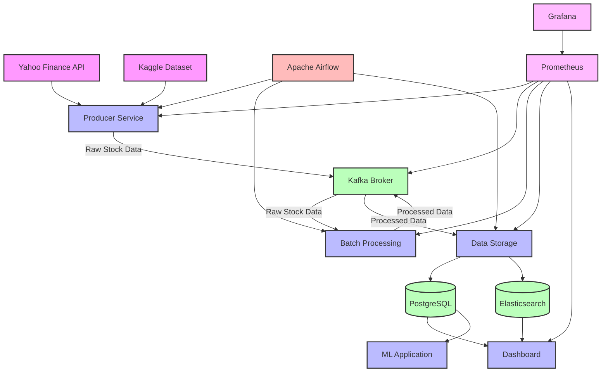

```mermaid
flowchart TD
    %% Data Sources
    YF[Yahoo Finance API] --> PS[Producer Service]
    KD[Kaggle Dataset] --> PS
    
    %% Producer Service
    PS --> |Raw Stock Data| KB[Kafka Broker]
    
    %% Kafka Broker
    KB --> |Raw Stock Data| BP[Batch Processing]
    KB --> |Processed Data| DS[Data Storage]
    
    %% Batch Processing
    BP --> |Processed Data| KB
    
    %% Data Storage
    DS --> PG[(PostgreSQL)]
    DS --> ES[(Elasticsearch)]
    
    %% Dashboard and ML Application
    PG --> DA[Dashboard]
    ES --> DA
    PG --> ML[ML Application]
    
    %% Workflow Orchestration
    AF[Apache Airflow] --> PS
    AF --> BP
    AF --> DS
    
    %% Monitoring
    PM[Prometheus] --> PS
    PM --> KB
    PM --> BP
    PM --> DS
    PM --> DA
    GF[Grafana] --> PM
    
    %% Styling
    classDef source fill:#f9f,stroke:#333,stroke-width:2px
    classDef service fill:#bbf,stroke:#333,stroke-width:2px
    classDef storage fill:#bfb,stroke:#333,stroke-width:2px
    classDef orchestration fill:#fbb,stroke:#333,stroke-width:2px
    classDef monitoring fill:#fbf,stroke:#333,stroke-width:2px
    
    class YF,KD source
    class PS,BP,DS,DA,ML service
    class KB,PG,ES storage
    class AF orchestration
    class PM,GF monitoring
```
